# 🍎 Global Apple & Banana Trade Network Analysis 🍌

**CSI500 - Yoonjoo Lee**

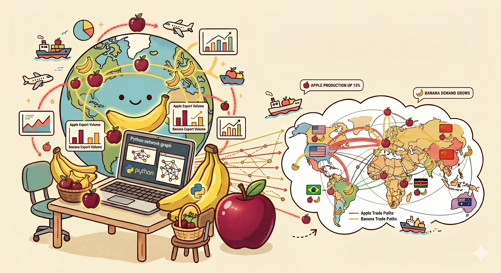

## Table of Contents

1. [Project Overview](#1-project-overview)
2. [Network Analysis Methods](#2-network-analysis-methods)
3. [Cross-sectional Analysis in 2020](#3-cross-sectional-analysis-in-2020)
4. [Temporal Analysis 1990–2024](#4-temporal-analysis-19902024)
5. [Apple vs. Banana Network Comparison](#5-apple-vs-banana-network-comparison)
6. [Conclusion](#6-conclusion)


## 1. Project Overview

### 1-1. Project Purpose

The main question of this project is:

**Apples and bananas are produced in different climate regions. Does this difference also appear in their global trade network structures?**

Apples are mainly produced in temperate climate regions, while bananas are mainly produced in tropical climate regions. Therefore, this project does not only examine which countries export or import the most. It also analyzes how countries are connected to each other through global trade networks.

The main questions are:

1. How densely connected are the apple and banana trade networks?
2. Which countries are the major exporters and importers?
3. Which countries act as brokers in the trade network?
4. How does the difference between temperate fruits and tropical fruits appear in the global trade structure?

---

### 1-2. Data Source

This project uses country-to-country trade data for apples and bananas from [FAOSTAT](https://www.fao.org/faostat/en/#data/domains_table). The analysis mainly uses export and import trade quantities by country. Production, population, and GDP data were also used as additional reference data.

The target items are:

- Apples
- Bananas

The analysis covers the period from **1990 to 2024**.

---

### 1-3. Data Preprocessing and Normalization

In this analysis, trade relationships between countries are represented as edges in a network.  
Since only `Export quantity` data was used, `Reporter Countries` represent exporting countries, and `Partner Countries` represent importing countries.

- Exporting country: `Reporter Countries`
- Importing country: `Partner Countries`
- Trade quantity: `Value`

For example, if country A exports apples to country B, the directed edge is represented as:

```text
Country A → Country B
```

This project uses two filtering standards.

* For the 2020 cross-sectional analysis, Top 10 analysis, and centrality analysis, only trade relationships of **3,000 tons or more** were used. This helps reduce noise from very small trade flows and makes the main network structure easier to see.

* For temporal analysis, density, and heatmaps, trade relationships of **1 ton or more** were used. This is because the purpose of these analyses is to observe long-term changes in the overall trade connectivity.

In other words, the 3,000-ton threshold was used to focus on the **main trade structure**, while the 1-ton threshold was used to examine **overall connectivity changes over time**.

---

### 1-4. Continent Color Mapping

To show regional differences in the network visualizations, each country was colored by continent.

| Continent | Color |
|---|---|
| Asia | 🟧 Pastel Orange `#FFD6A5` |
| Europe | 🟦 Pastel Blue `#A8DADC` |
| Africa | 🟩 Pastel Green `#B7E4C7` |
| North America | 🟪 Pastel Purple `#CDB4DB` |
| South America | 🟥 Pastel Coral `#FFB4A2` |
| Oceania | 🟨 Pastel Yellow `#FFF1A8` |
| Other | ⬜ Light Gray `#D9D9D9` |

---

### 1-5. Heatmap Normalization Method

For the heatmaps, normalization was used because trade quantities differ greatly by country.

Each country’s yearly trade quantity was divided by that country’s maximum trade quantity during the entire period, so the values were converted to a range between 0 and 1.

```python
heat_norm = heat_data.div(heat_data.max(axis=1), axis=0)
```

This method makes it easier to observe how each country’s trade quantity changes over time, rather than only comparing absolute trade volumes across countries.

Therefore, a darker color in the heatmap does not mean the largest value in the whole world. It means that the value is relatively high within that country’s own trade history.


## 2. Network Analysis Methods

### Network Density

Network density shows how densely connected a network is.

A higher density value means that more countries are connected through trade relationships.

---

### Degree Centrality

Degree centrality shows how many countries a country is directly connected to.

* Out-degree: export connections
* In-degree: import connections

A country with a high degree value can be seen as a major exporter or importer in the network.

---

### Betweenness Centrality

Betweenness centrality shows how often a country lies between other countries in the network.

A country with high betweenness centrality can be understood as a broker or intermediary in the trade network.


## 3. Cross-sectional Analysis in 2020

### 3-1. Overall Network Structure Comparison

First, the apple and banana trade networks in 2020 were visualized.

**Apple Trade Network (2020)**

<p align="center">
  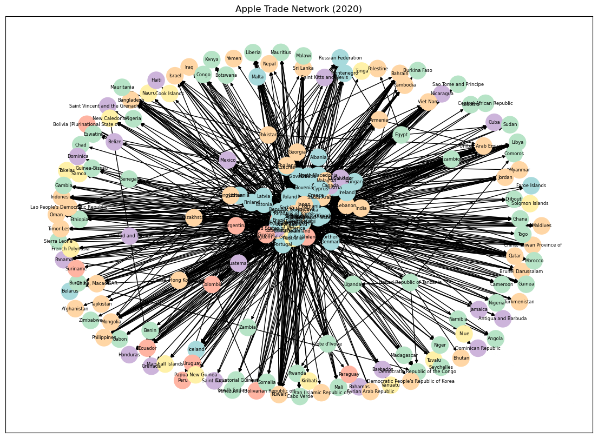
</p>

**Banana Trade Network (2020)**

<p align="center">
  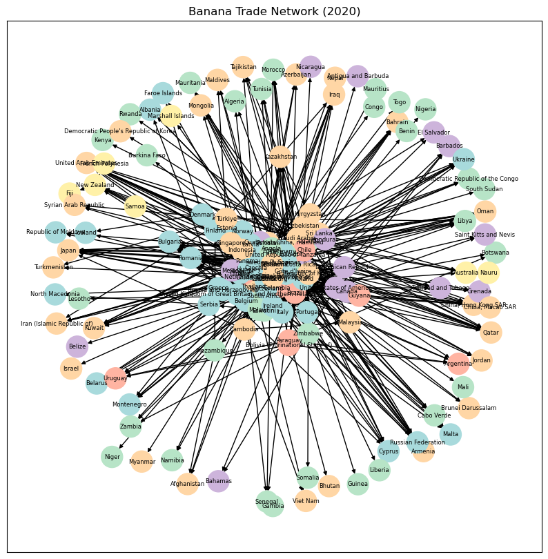
</p>

**Network Density Values**

* Apple: 0.03849 (2020)
* Banana: 0.03458 (2020)

The apple network has a slightly higher density than the banana network, but the difference is not very large. This suggests that both items had a certain level of global trade connectivity in 2020.

---

### 3-2. Degree Analysis: Export Hubs and Import Hubs

Degree analysis was used to identify which countries exported or imported large quantities. In a directed network, out-degree represents export connections, while in-degree represents import connections. In this analysis, weighted degree was calculated using trade quantity (`Value`) as the weight.

---

**Top 10 Apple Exporters (2020)**

<p align="center">
  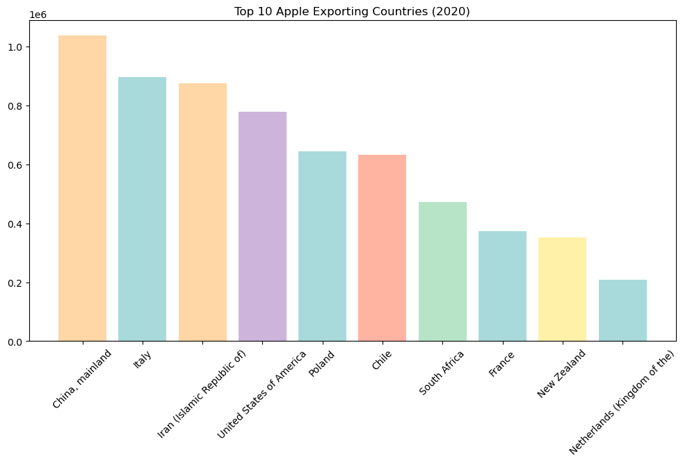
</p>

In 2020, China, mainland had the highest apple export quantity, with about 1,036,226 tons. It was followed by Italy, Iran (Islamic Republic of), United States of America, Poland, and Chile. The top exporters include countries from Asia, Europe, North America, and South America. This shows that apple exports are distributed across several temperate production regions.

**Apple Export Network (2020) - Top 20**

<p align="center">
  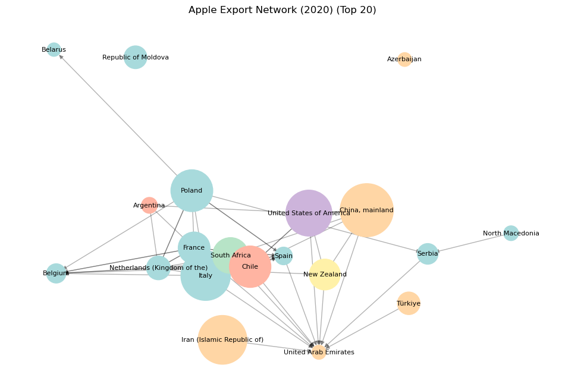
</p>

The Top 20 apple export network also shows major producing countries from Europe, Asia, South America, and Oceania. This indicates that apple exports are not concentrated in only one region.

---

**Top 10 Apple Importers (2020)**

<p align="center">
  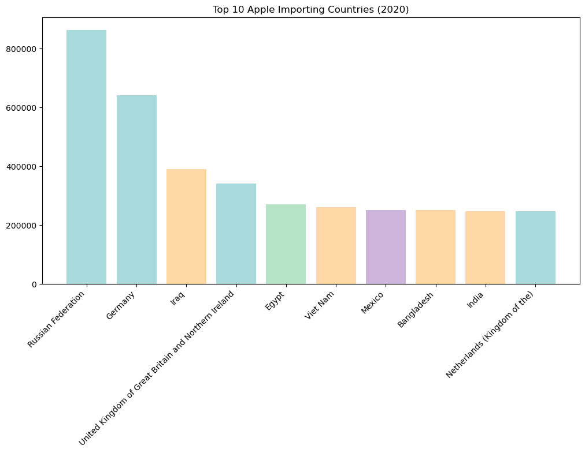
</p>

In 2020, Russian Federation had the highest apple import quantity, with about 862,569 tons. It was followed by Germany, Iraq, United Kingdom, Egypt, and Viet Nam. The top importers include countries from Europe, the Middle East, Asia, and North Africa. This suggests that apple import demand is spread across many regions.

**Apple Import Network (2020) - Top 20**

<p align="center">
  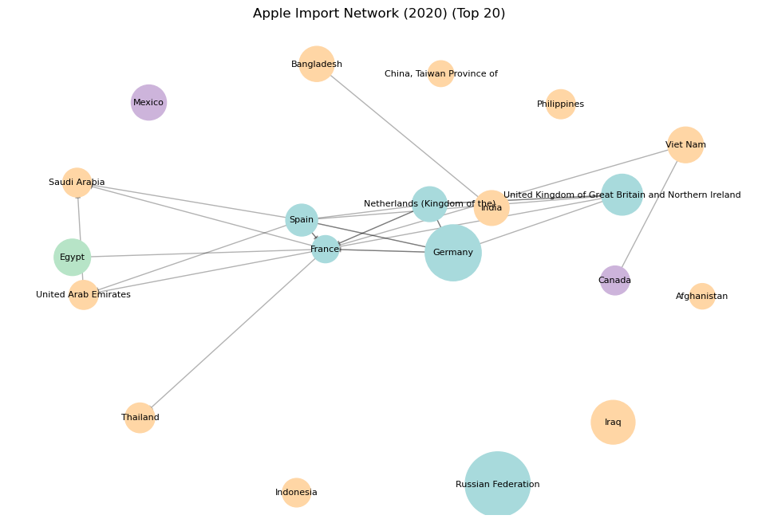
</p>

In the Top 20 apple import network, large importing nodes such as Germany, Russian Federation, and Iraq appear clearly. Major consumer countries from Europe, the Middle East and North Africa, and Asia are also included. This shows that apple imports are distributed across different consumer markets.

---

**Top 10 Banana Exporters (2020)**

<p align="center">
  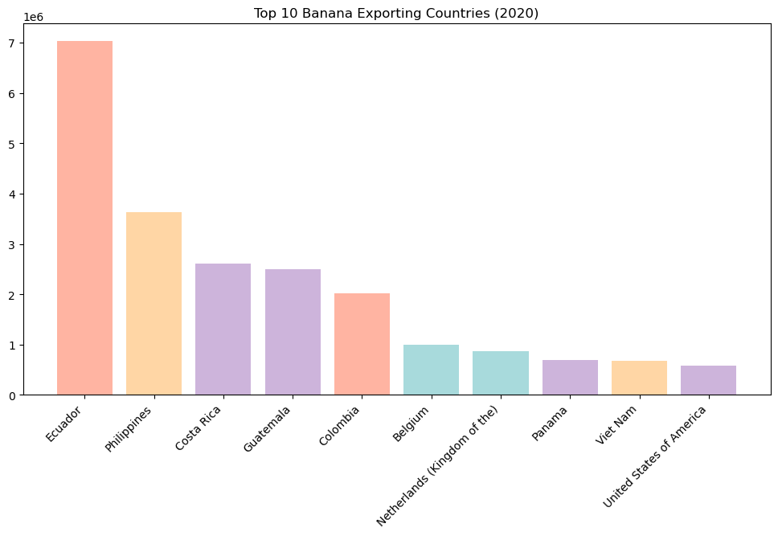
</p>

In 2020, Ecuador had the highest banana export quantity, with about 7,024,543 tons. This was much higher than the second-ranked country, Philippines, which exported about 3,625,160 tons. This shows that Ecuador is a key export hub in the global banana trade. Philippines, Costa Rica, Guatemala, and Colombia followed Ecuador. Most of the top banana exporters are tropical countries in Central and South America or Southeast Asia.

**Banana Export Network (2020) - Top 20**

<p align="center">
  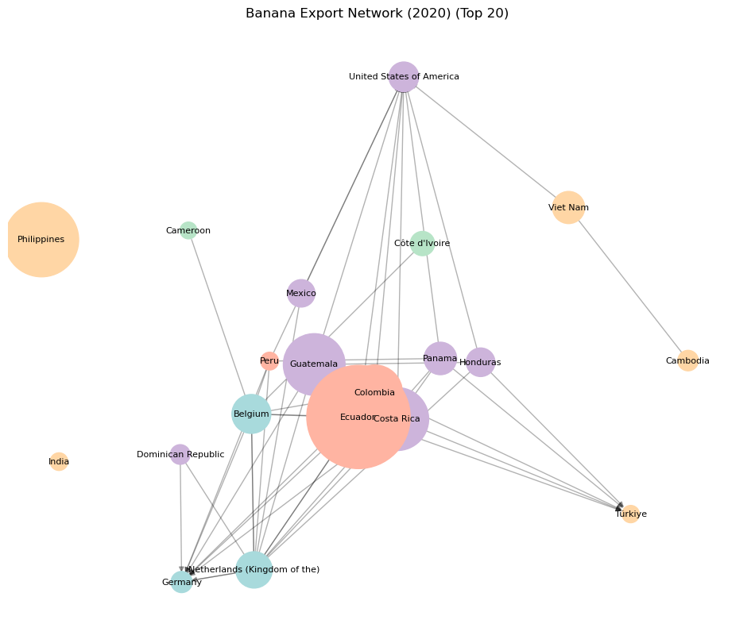
</p>

In the Top 20 banana export network, Ecuador appears as the largest central node, and strong connections from Central and South American producers are also visible. European countries such as Belgium and Netherlands are also included among the top export nodes. These countries are likely related to re-export and distribution functions within Europe, rather than actual banana production.

---

**Top 10 Banana Importers (2020)**

<p align="center">
  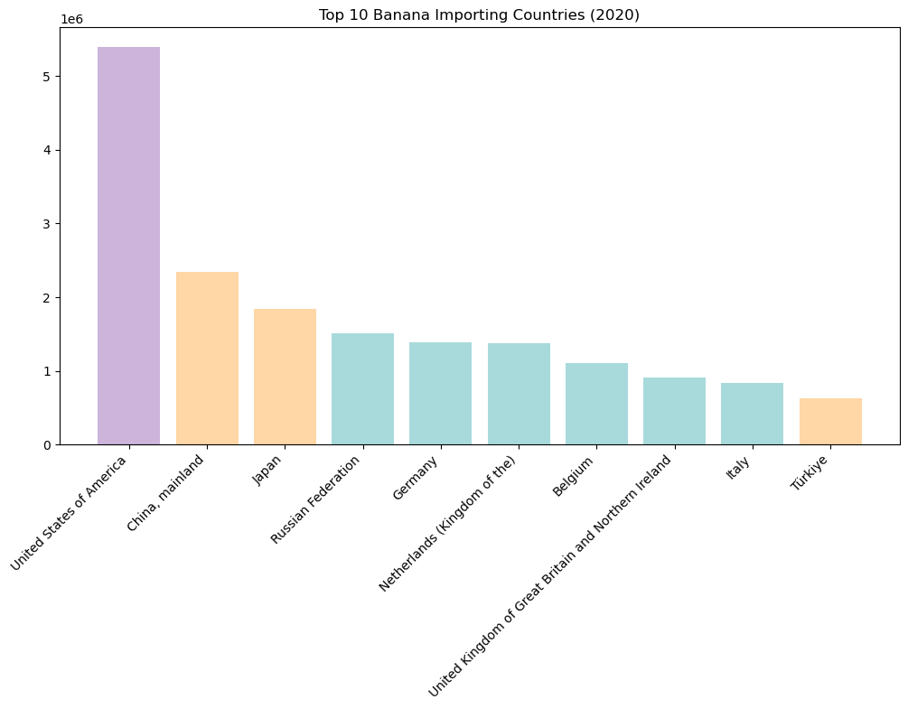
</p>

In 2020, United States of America had the highest banana import quantity, with about 5,390,685 tons. It was followed by China, mainland, Japan, Russian Federation, and Germany.

Bananas can only be produced in limited tropical and subtropical regions, but banana consumption is spread across many countries. In particular, United States of America appears as the largest importer because it has a large consumer market and is geographically close to major producers in Central and South America. This shows that banana trade has a clear separation between production regions and consumption regions.

**Banana Import Network (2020) - Top 20**

<p align="center">
  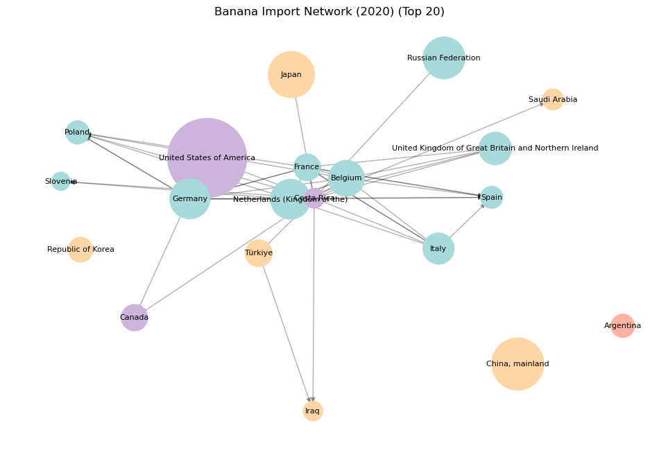
</p>

In the Top 20 banana import network, United States of America appears as the largest import node. Large consumer markets such as China, Japan, and Germany are also included, showing that banana imports are spread across several major consumption regions. Netherlands and Belgium appear in both import and export networks, suggesting that they may serve as distribution and re-export hubs within Europe.

---

### 3-3. Centrality Analysis: Network Hubs and Brokers

**Apple Degree Centrality (2020)**

<p align="center">
  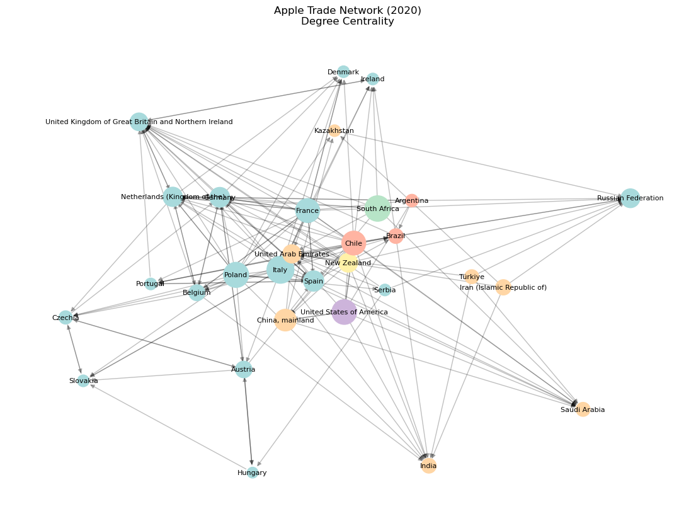
</p>

Degree centrality does not simply show which countries have the largest export or import volumes. Instead, it shows how many countries a country is directly connected to. Italy had the highest degree centrality, followed by South Africa, Poland, United States of America, Chile, and France. China, mainland, which ranked first in export quantity, had lower degree centrality than Italy. This means that Italy was directly connected to a wider range of countries than China. Among the Top 30 countries, 16 were European countries, suggesting that the apple trade network has a multi-hub structure where several countries share network centrality.

**Banana Degree Centrality (2020)**

<p align="center">
  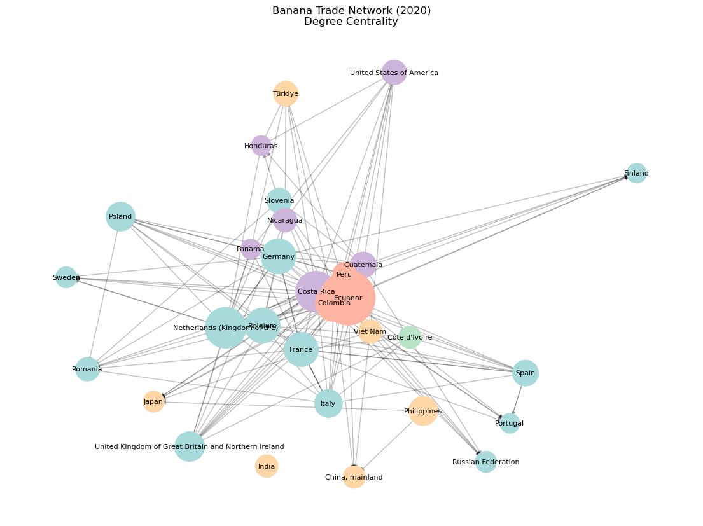
</p>

Ecuador had the highest degree centrality, showing that it is a key hub not only in export volume but also in network connectivity. Costa Rica, Netherlands, Colombia, Germany, and Belgium followed. Ecuador, Costa Rica, and Colombia mainly act as supply hubs, while Netherlands and Belgium appear to act as connection hubs in European import, re-export, and distribution processes. In other words, the banana network is concentrated around tropical producing countries in terms of export volume, but in terms of degree centrality, both production hubs and European distribution hubs form the center of the network.

**Top 10 Apple Trade Brokers (2020)**

<p align="center">
  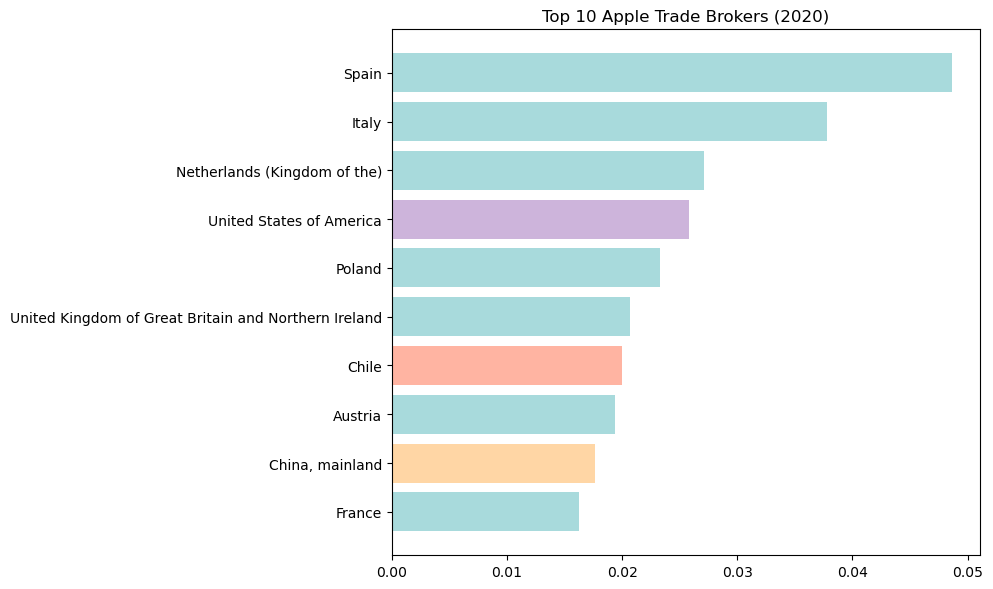
</p>

Betweenness centrality shows how often a country connects trade flows between other countries. In the apple trade network, Spain had the highest betweenness centrality value at 0.0487, followed by Italy, Netherlands, United States of America, and Poland. Many of the Top 10 broker countries are European countries, which suggests that Europe plays an important intermediary role in apple trade flows.

**Top 10 Banana Trade Brokers (2020)**

<p align="center">
  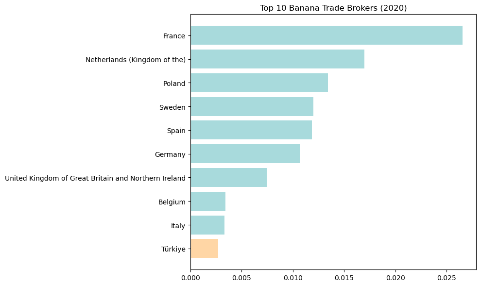
</p>

In the banana trade network, France had the highest betweenness centrality value at 0.0265, followed by Netherlands, Poland, Sweden, Spain, and Germany. Most of the Top 10 broker countries are European countries. This shows that the roles of production hubs, such as Ecuador and Costa Rica, and intermediary hubs, mainly in Europe, are separated in the banana trade network.


## 4. Temporal Analysis 1990–2024

### 4-1. Changes in Network Density

**Apple vs Banana Trade Network Density Over Time**

<p align="center">
  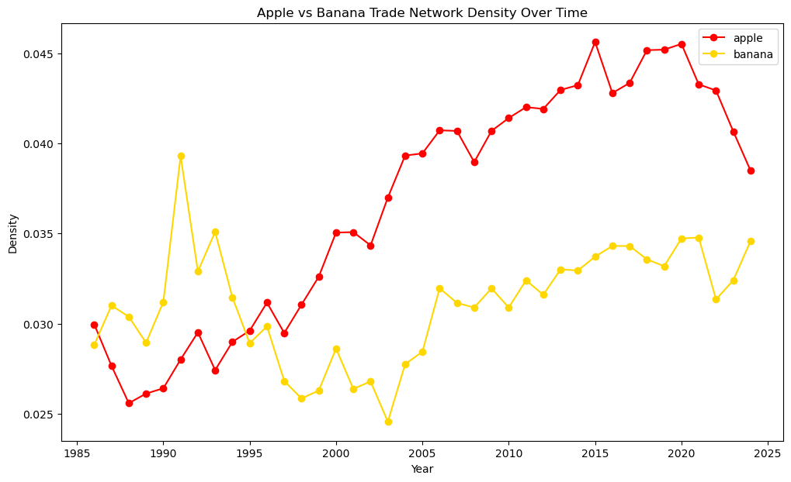
</p>

Overall, the apple network shows higher density than the banana network. The average density over the entire period is 0.0377 for apples and 0.0313 for bananas. Apple network density generally increased after the 1990s and reached around 0.04 in the 2000s. This can be interpreted as a result of apples being relatively easier to store and transport, which may have allowed more countries to form trade connections.

In contrast, the banana network had relatively high density in the early 1990s, then declined until the early 2000s, and later recovered gradually. This pattern may be related to the fact that banana production is limited to tropical and subtropical regions, so the network tends to remain centered around specific producer countries and major consumer markets.

Changes in European banana import policies in the 1990s may also help explain this pattern. After the formation of the EU single market in 1993, banana import rules were unified. ACP bananas received preferential treatment, while Latin American bananas faced higher trade barriers. This led to opposition from the United States and Latin American exporters, which became known as the “Banana Wars.” Therefore, the decline in density from the late 1990s to the early 2000s may be connected to changes in European trade policy and trade disputes that reshaped some banana trade routes.

---

### 4-2. Heatmap Analysis: Long-term Changes in Major Countries

**Apple Export Heatmap**

<p align="center">
  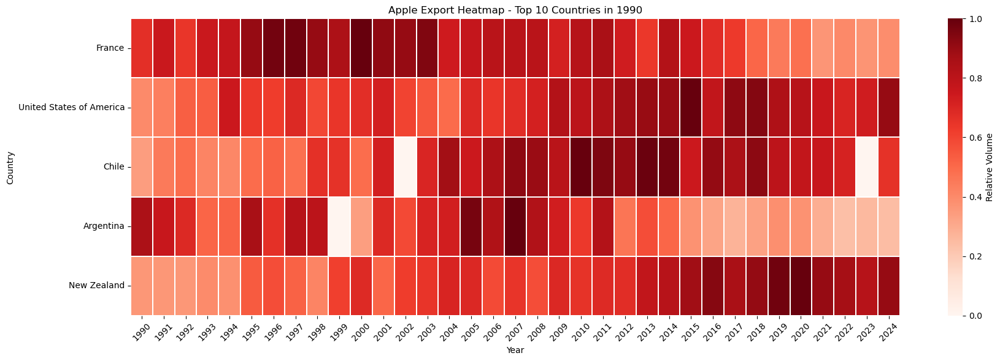
</p>

France showed a high level of apple exports from the 1990s to the early 2000s, but its export level gradually weakened afterward. In contrast, United States of America and Chile maintained relatively high export levels throughout the period. Chile and New Zealand are Southern Hemisphere countries, so they can supply apples during the off-season in the Northern Hemisphere. This seasonal advantage helps explain their importance in the apple export network. New Zealand, in particular, becomes more important in recent years.

**Apple Import Heatmap**

<p align="center">
  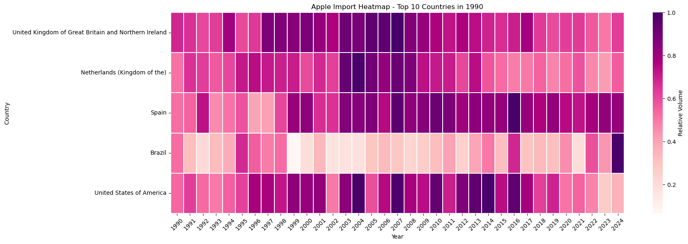
</p>

United Kingdom and Netherlands maintained high apple import levels during the 1990s and 2000s. Brazil showed relatively lower values in the middle period, but became strong again in 2024.

**Banana Export Heatmap**

<p align="center">
  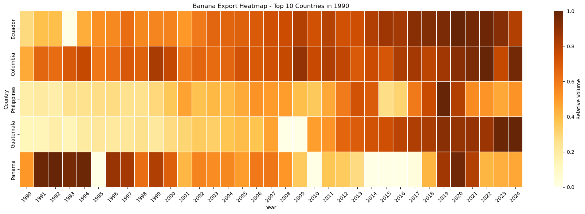
</p>

Ecuador became stronger over time and continued to show very high export levels in the 2020s. Guatemala also grew rapidly after the 2010s and reached a high export level in the 2020s. In contrast, Panama showed a long-term weakening pattern after the 1990s.

**Banana Import Heatmap**

<p align="center">
  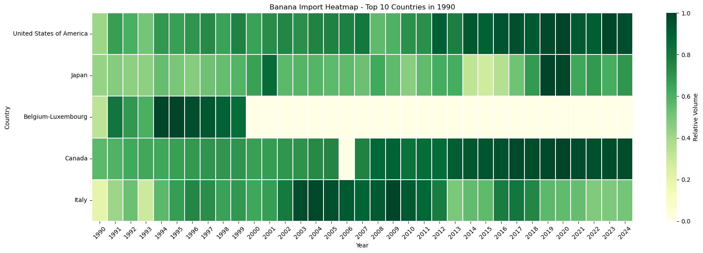
</p>

United States of America maintained a high import level throughout the entire period, and became especially strong after the late 2010s. Belgium-Luxembourg appears strongly in the 1990s, but its value becomes 0 after 2000. This does not necessarily mean that trade disappeared. It is likely related to changes in the dataset, where Belgium-Luxembourg was later recorded separately as Belgium and Luxembourg.

---

### 4-3. GDP-ordered Heatmap Analysis

**Apple Export/Import by GDP Order**

<p align="center">
  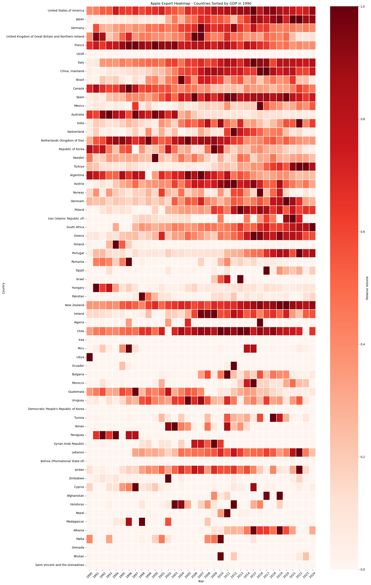
</p>

<p align="center">
  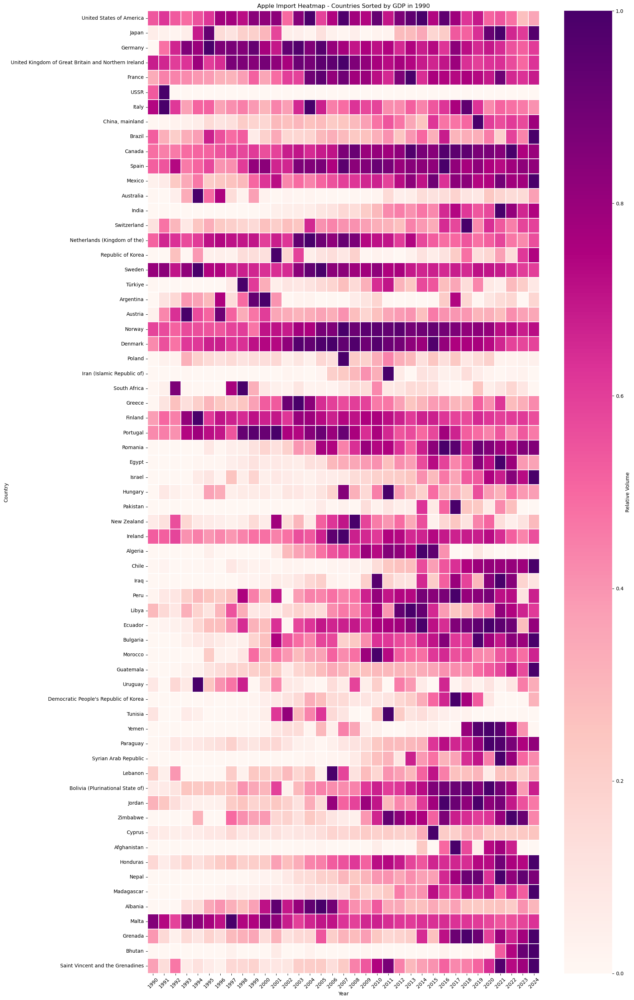
</p>

Apple exports cannot be explained only by GDP size. Countries with large economies, such as United States of America, Italy, China, mainland, and Spain, became important apple exporters over time. However, countries such as New Zealand and South Africa also appear strongly in apple exports even though they are not among the largest economies. This shows that apple exports are influenced not only by economic size, but also by suitable climate, agricultural production capacity, export infrastructure, and seasonal advantages.

In particular, Southern Hemisphere countries such as New Zealand and South Africa have different harvest seasons from Northern Hemisphere countries. This allows them to supply apples during the Northern Hemisphere off-season. Therefore, apple exports can be understood as a network shaped by both economic scale and agricultural specialization.

Apple imports, on the other hand, are more strongly related to economic size than exports. Large consumer markets such as Germany, United Kingdom, France, Canada, Spain, and Netherlands remained important importers for a long period. In addition, countries such as China, mainland and India became more important in apple imports as their economies and consumer markets expanded.

In short, apple exports are strongly influenced by climate and production specialization, while apple imports are more closely related to consumer market size and purchasing power.

**Banana Export/Import by GDP Order**

<p align="center">
  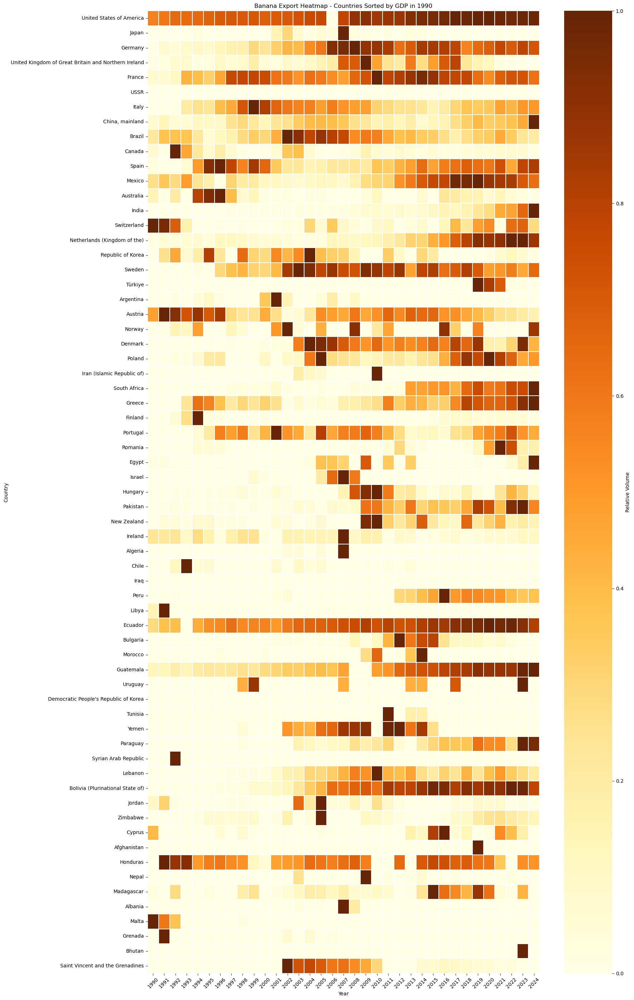
</p>

<p align="center">
  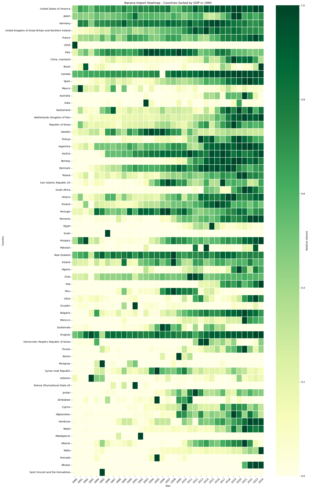
</p>

Banana exports are also difficult to explain only by GDP size. Since bananas are mainly produced in tropical and subtropical regions, the export structure is more strongly influenced by climate conditions and agricultural production capacity than by economic size. Countries such as Guatemala and South Africa are examples of countries that are not among the largest economies but still appear as important banana exporters.

At the same time, GDP-rich countries such as Netherlands, Germany, and France also appear strongly in banana exports. These countries are likely not actual banana producers, but re-export and distribution hubs for bananas imported into Europe. Therefore, banana exports show a structure where tropical production hubs and European distribution hubs appear together.

Banana imports are more clearly influenced by GDP and consumer market size. Countries with large economies, such as United States of America, Japan, Germany, France, and Canada, remained important banana importers for a long period. This shows that while banana production is limited to specific regions, banana consumption is widely distributed across large consumer markets.

Overall, the GDP-ordered heatmaps show that economic size has different meanings in exports and imports. Imports are more strongly related to GDP and consumer market size, while exports are also influenced by item-specific production conditions, climate, agricultural specialization, and re-export hub functions.


## 5. Apple vs. Banana Network Comparison

Overall, apples and bananas show different trade network structures.

Apple trade is relatively distributed across several regions. Major exporters and importers are spread across Asia, Europe, North America, and South America. The centrality results also show that several countries share important roles, so the apple network is closer to a multi-hub structure.

In contrast, banana trade shows a clearer separation between production and consumption regions. Exports are concentrated in tropical and subtropical producers such as Ecuador, Costa Rica, Guatemala, Colombia, and Philippines, while imports are concentrated in large consumer markets such as United States of America, China, Japan, Germany, and Canada.

The temporal analysis also supports this difference. The apple network became more connected over time, while the banana network remained more dependent on specific production regions and major trade routes.


## 6. Conclusion

This project compared the global trade network structures of apples and bananas using FAOSTAT trade data from 1990 to 2024.

The results show that apple trade is more distributed across different regions, while banana trade has a clearer separation between production and consumption regions. Apple exporters and importers are spread across several temperate regions, but banana exports are concentrated in tropical and subtropical producers such as Ecuador, Costa Rica, Guatemala, Colombia, and Philippines.

The centrality results also support this difference. The apple network has a multi-hub structure, while the banana network separates production hubs from European distribution and re-export hubs.

Overall, fruit trade networks are shaped not only by economic size, but also by climate, production specialization, seasonality, and distribution infrastructure.
